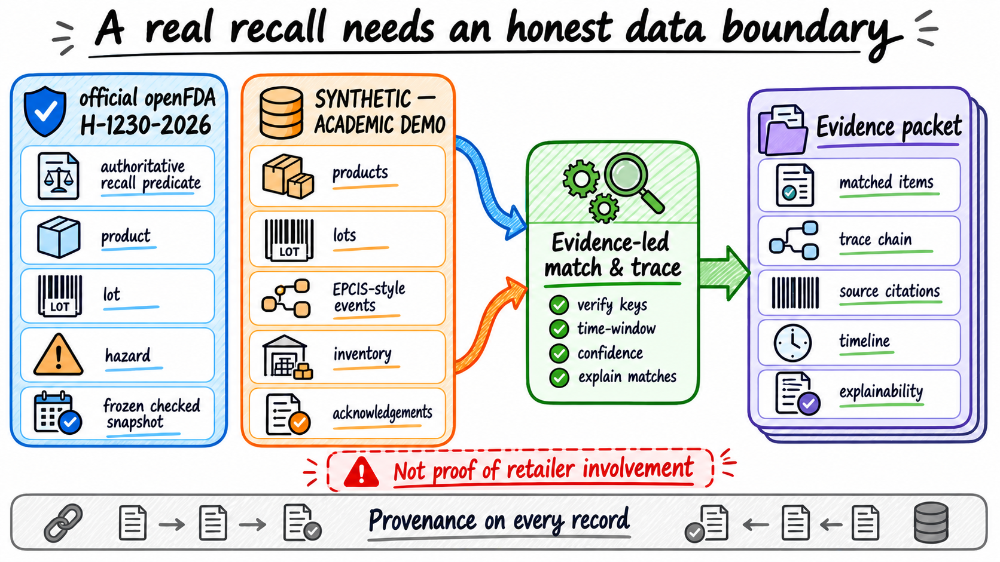
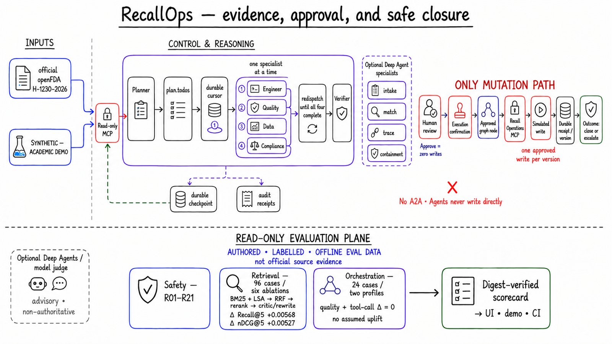
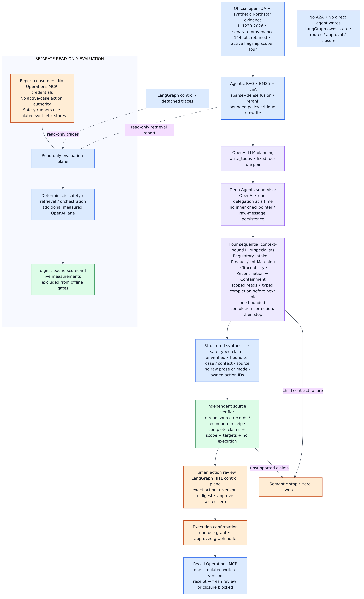
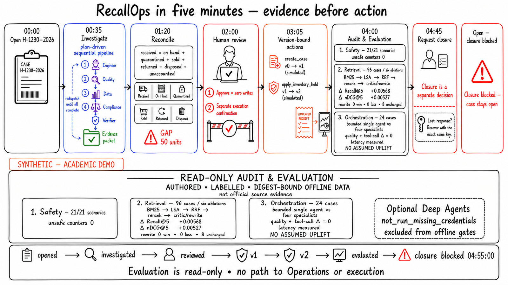

# RecallOps Command Center

RecallOps is an evidence-first food-recall response command center built for the GenAI Academy Week 3 project. It converts an official recall notice into an auditable simulated retailer case: retrieve cited context, match products and lots, trace movement, reconcile every unit, draft containment, stop for human authorization, record one approved simulated action per case version, and refuse unsafe closure.

The point is not “a chatbot answered a recall question.” The point is that an explicit agentic workflow can show what it knows, what it does not know, who authorized each action, and why a case must stay open.

Start with the [business-domain guide](docs/BUSINESS_DOMAIN.md), [business recall lifecycle](docs/images/08_business_recall_lifecycle.svg), and [domain evidence model](docs/images/09_domain_evidence_model.svg). They explain the operating problem before the software.





The presentation visuals above are backed by the reproducible [data-provenance Mermaid diagram](docs/images/01_data_provenance.svg), [technical system diagram](docs/images/02_system_architecture.svg), and [evaluation architecture](docs/images/10_evaluation_architecture.svg).

## What is implemented

- A durable LangGraph `StateGraph` with JSON-only state, SQLite checkpoints, exact interrupt binding, restart-safe resume, and request/head fencing across the checkpoint and Operations stores.
- The live OpenAI reasoning lane is part of the durable workflow: bounded retrieval feeds an LLM `write_todos` plan and the Deep Agents supervisor delegates once to each of four sequential context-bound LLM specialists. Safe typed claims are independently checked against source records before action generation. The supervisor cannot access Operations MCP.
- Agentic RAG over 1,175 citable records: BM25 sparse retrieval plus local TF-IDF/SVD LSA dense retrieval, reciprocal-rank fusion, deterministic reranking, an evidence critic, query rewriting, provenance checks, and hard limits of two hops, four queries, and eight reads.
- Three FastMCP servers with equivalent direct and stdio gateway surfaces: Recall Registry, Traceability, and approval-gated simulated Recall Operations.
- Middleware for context, structured validation, provenance, masking, retry, circuit breaking, budgets, approval, idempotency, versioning, progress detection, and structured traces.
- Dual consent for every write: human action review records approval but writes nothing; a separate execution confirmation powers **Simulate approved actions**. A runtime-only, checkpoint-bound broker issues the one-use execution grant; normal service and MCP consumers cannot mint authority. Exactly one operation can advance one case version.
- A five-view Streamlit command center, CLI, 21-scenario deterministic red-team evaluator, 96-case six-configuration retrieval ablation, 24-case two-profile orchestration comparison, seven self-contained teaching notebooks, and eleven reproducibly rendered technical diagrams. The pinned integrated report records 21/21 safety scenarios passing, fusion Recall@5 delta `+0.005681818181818121`, rerank nDCG@5 delta `+0.005266955662502459`, and zero deterministic orchestration quality/tool-call uplift. The committed live evaluation status is `not_run_missing_credentials` and contains no successful live metrics; current smoke status appears below, and historical hashes and scope are in [Verification](docs/VERIFICATION.md).

Live validation on September 12, 2026 did not establish a successful investigation. After timeout, response-schema and explicit read-contract corrections, one fresh bounded OpenAI `gpt-5-mini` attempt observed the four-role plan, completed recall intelligence, and performed three sealed MCP reads. The matching task then failed with `semantic_failure` / `invalid_response`; there was no human review and zero write receipts. This latest failed attempt took 314.421 seconds, nine model calls and 140,356 tokens. Earlier attempts timed out or stopped before reads. A completed, independently verified live run remains outstanding; the historical offline scorecard is separate from these failed live attempts.

## Honest data boundary

The public source is a frozen, checksummed five-row openFDA response captured from a rolling, mutable report-date-sorted endpoint, including `H-1230-2026`. The URL identifies the historical capture method; running it later is not expected to reproduce those same five rows. A separate exact-recall-number query was verified on 2026-09-07: it returned one flagship record matching the first frozen row field-for-field. The capture URL and verification URL remain distinct in the strict metadata receipt. An allowlisted live lookup can call only `api.fda.gov` and falls back to the labelled snapshot. The fictional Northstar Grocers digital twin contains 48 products, 144 lots, 18 facilities, 577 EPCIS-like events, 216 inventory positions, 144 supplier shipments, and 18 facility acknowledgement seeds.

Every operational record is labelled **SYNTHETIC — ACADEMIC DEMO**. The public notice does not prove that Northstar or any synthetic facility was involved. RecallOps has no You.com dependency and performs no general web search; policy and operational retrieval use the committed, checksummed corpus.

## Quick start

Prerequisites: Python 3.12, `uv`, Node 24.15.0, npm 11.12.1, and a running Docker Desktop or Docker Engine with `linux/amd64` support for diagram verification. `make setup` checks Docker and fetches the digest-pinned renderer once; subsequent renders run without container network access. See [artifact dependencies and regeneration](docs/images/README.md). Docker is not needed to run the application itself.

```bash
make setup
make data-validate
make demo
make ui-openai
```

For live setup, create a repository-local ignored `.env` using [the exact demo preflight](docs/DEMO_WALKTHROUGH.md#preflight): set `RECALLOPS_MODEL_MODE=openai`, a nonblank `OPENAI_MODEL`, and your private `OPENAI_API_KEY`. Do not overwrite an existing `.env`. The header must show `Reasoning mode: OpenAI · <model>` and `ready`; readiness validates configuration, not provider access.

Bounded sparse+dense fusion, reranking, and policy-based retrieval critique/rewrite provide context → OpenAI LLM `write_todos` planning → Deep Agents supervisor → four sequential context-bound LLM specialists → safe typed claims → independent source verifier → HITL control plane.



Run `make help` to list the complete project interface. The Streamlit app defaults to the durable SQLite-backed runtime and direct MCP gateway. `RECALL_NUMBER`, `PORT`, and `RUNTIME_DIR` are configurable, for example `make ui PORT=8765 RUNTIME_DIR=.recording-runtime`.

The complete credential-free evaluation workflow is `make eval`: it regenerates the 21-case safety
suite, 96-case retrieval ablation, and 24-case orchestration comparison, then atomically builds and
validates their digest-bound combined scorecard. Use `make eval-fast` for artifact validation plus
stable metric smoke tests, or `make eval-summary` to validate the existing scorecard without
regeneration. The legacy `uv run recallops eval --report data/evals/report.json` command remains the
safety-only summary; `uv run recallops eval-scorecard` is the distinct combined summary. For one bounded live investigation, use `make eval-model LIVE_SMOKE=1 LIVE_SMOKE_REPORT=/tmp/recallops-live-smoke-new.json`. The shared OpenAI provider and independent verifier record sanitized status, plan/order checks, call counts, digests, duration and available tokens in a separate new report; failure exits nonzero, and existing reports are never overwritten. This is a smoke check, not a comparative benchmark. Running `make eval-model` without `LIVE_SMOKE=1` incurs the full 24-case live evaluation and regenerates its orchestration report and scorecard. Both live lanes are excluded from deterministic pass/fail gates. `LIVE_MODEL_ADAPTER=module:attribute` is an optional trusted local override for the full benchmark, not a prerequisite for the built-in provider. Request controls default to `OPENAI_TIMEOUT_SECONDS=120` and `OPENAI_MAX_RETRIES=0`; see the [walkthrough](docs/DEMO_WALKTHROUGH.md) for limits.

To demonstrate actual stdio MCP subprocesses:

```bash
make ui-stdio
```

Optional live public lookup is deliberately narrow:

```bash
RECALLOPS_SOURCE_MODE=live uv run streamlit run src/recallops/ui/app.py
```

The durable graph uses the pinned snapshot for repeatable evidence. Live reasoning requires OpenAI credentials; `RECALLOPS_MODEL_MODE=deterministic make ui` and `make demo` provide the explicitly labelled credential-free lane. See [Operations](docs/OPERATIONS.md) for validation, evaluator, MCP, notebook, and security commands.

GitHub Actions uses immutable action SHAs, disables persisted checkout credentials, and runs the
same credential-free core contract through `make ci`: locked installation, data and artifact
validation, tests, diagrams, MCP smoke, deterministic evaluation, and production dependency/security
gates. The Python gate audits a fully hashed production-only export from `uv.lock`; the separately
installed audit tool is not mistaken for the application environment. Development-only
Mermaid/Puppeteer advisories are reported separately.

## Flagship proof



The flagship mixed-lot case reaches human review with official citations, synthetic trace evidence, classifications, and the reconciliation equation:

`received = on_hand + quarantined + sold + returned + disposed + unaccounted`

The Streamlit walkthrough then shows two complete consent cycles:

1. approve `create_case`, separately confirm execution, and record the v0→v1 receipt;
2. review the newly planned `apply_inventory_hold`, approve it, separately confirm execution, and record the v1→v2 receipt.

The graph never batches those writes and never reuses approval after a version change. The flagship still ends **Open — closure blocked** because ambiguity and reconciliation gaps remain. A separate probable-only evaluator scenario proves that disposition, facility tasks, repeated acknowledgements, closure review, and `close_case` can reach a safe simulated close when all authoritative gates pass.

## Documentation map

- [Proposal](PROPOSAL.md) — product thesis, differentiation, and scope.
- [Architecture](docs/ARCHITECTURE.md) — control, reasoning, retrieval, MCP, and action planes.
- [Data sources](docs/DATA_SOURCES.md) — source register, counts, hashes, and network boundary.
- [MCP and tools](docs/MCP_AND_TOOLS.md) — all three servers, tools, transports, and write contract.
- [Middleware and HITL](docs/MIDDLEWARE_AND_HITL.md) — policies, dual consent, recovery, and fencing.
- [Operations](docs/OPERATIONS.md) — exact local commands and recovery runbook.
- [Evaluation](docs/EVALUATION.md) — safety, six-configuration retrieval ablation, two-profile orchestration comparison, and digest-bound scorecard.
- [Human presentation rubric](docs/EVALUATION_RUBRIC.md) — anchored review scores and authority limits.
- [Week 3 coverage](docs/CURRICULUM_COVERAGE.md) — topic-to-code/demo map.
- [Demo walkthrough](docs/DEMO_WALKTHROUGH.md) — a 4:55 presenter script with exact clicks, evaluation narration, and copy/paste inputs.
- [Submission document](docs/SUBMISSION_DOCUMENT.md) — reviewer-ready handout.
- [Verification](docs/VERIFICATION.md) — executed evidence only.

## Safety and limitations

RecallOps is academic decision support. It does not access a real ERP/WMS/POS, contact consumers or regulators, place real holds, process real customer PII, provide production authentication, or make autonomous public-health or compliance decisions. It is not legal or food-safety advice. There is no A2A protocol: LangGraph coordinates the workflow, and MCP is the vertical tool/data boundary.
