# Architecture

**Status:** approved architecture contract pending Task 11 runtime integration.

RecallOps has three deliberately separated planes.

1. **Control plane:** an outer LangGraph `StateGraph` owns lifecycle state, branch choices, bounded recovery, interrupts, resume, and checkpointing by `thread_id`.
2. **Reasoning plane:** the deterministic planner and fixed specialists produce structured, cited observations. In live mode, an optional Deep Agent supervisor plans and delegates within the same bounded task contract. The independent Verification/Critic node remains outside that supervisor.
3. **Action plane:** narrow MCP tools expose public recall data, synthetic traceability data, and simulated operational actions. No agent receives raw database access.

## Lifecycle

`intake → plan → specialist fan-out → reconcile → verify → human review → execute approved writes → monitor → close or escalate`

Each node returns a typed update to `RecallCaseState`. The checkpointer allows `Command(resume=...)` with the same `thread_id` after a review pause or process restart. Code before an interrupt is side-effect free or idempotent; writes are after the approved resume.

## Design constraints

- The public recall notice is authoritative for recall scope.
- Every Northstar operational record is `SYNTHETIC — ACADEMIC DEMO` and has synthetic provenance.
- There is **no A2A**. Agents coordinate only inside LangGraph.
- There are **no direct agent writes**. Only approved graph nodes call the write-sensitive MCP gateway.
- A closure request must pass reconciliation, facility coverage, ambiguity, approval, and version checks.

## Reliability

Read tools can retry with bounded backoff and use the pinned snapshot when openFDA is unavailable. Write paths fail closed on policy, timeout, or stale version; replaying the same idempotency key must return the original logical receipt. Repeated progress signatures escalate instead of looping.
