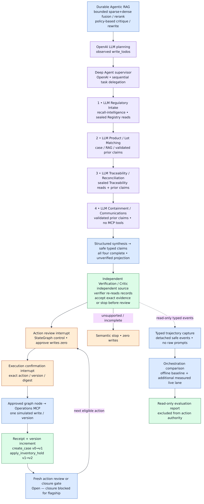

# RecallOps Architecture

The [business-domain guide](BUSINESS_DOMAIN.md), [business recall lifecycle](images/08_business_recall_lifecycle.png), and [domain evidence model](images/09_domain_evidence_model.png) define the operating problem. This document maps that problem onto the implemented control, retrieval/reasoning, tool, state, and action boundaries.

The presentation visual summarizes the boundaries. The [five-minute demo story](images/recallops-five-minute-demo.png) shows the operator-facing sequence. The reproducible [technical architecture](images/02_system_architecture.png), [orchestration](images/03_orchestration.png), [MCP safety](images/04_mcp_tool_safety.png), [middleware lifecycle](images/05_middleware_lifecycle.png), and [evaluation architecture](images/10_evaluation_architecture.png) carry the implementation detail.

## Architectural thesis

RecallOps separates evidence gathering from operational authority:

- read paths may retrieve, rank, trace, and propose;
- the graph owns ordering, state, interrupts, and retries;
- the independent verifier checks deterministic invariants;
- a human authorizes one exact action at one exact case version;
- a second human confirmation permits the approved graph node to call Operations MCP once;
- a runtime-only authorization broker, held outside the public service/gateway surface, mints a one-use execution grant from the active checkpoint resume and binds it to that action and actor;
- Operations SQLite atomically consumes the grant and revalidates recall scope, version, idempotency, evidence, lifecycle, and closure inside the transaction.

No agent, retrieved document, UI callback, or MCP transport can skip those layers.

## Component map

| Plane | Implemented components | Authority |
|---|---|---|
| Data | Frozen openFDA snapshot, five policy references, seeded Northstar twin, manifests/checksums | Defines evidence and provenance; never authorizes a write |
| Retrieval | BM25, TF-IDF/SVD LSA, RRF, deterministic rerank, source routing, evidence critic, bounded rewrite | Advisory cited context only |
| Reasoning | OpenAI LLM, `write_todos`, Deep Agents supervisor, four sequential context-bound specialists | Produces unverified safe typed claims; no Operations access |
| Verification | Independent source resolver, strict claim and receipt comparison | Releases source-owned actionable state only after acceptance |
| Control | LangGraph `StateGraph`, conditional edges, JSON-only state, `interrupt()`, `Command(resume=...)` | Owns lifecycle, side-effect order, and human pauses |
| Tool | Three FastMCP servers; direct and stdio gateways | Exposes narrow typed reads and simulated writes |
| Durable state | LangGraph checkpoint SQLite plus Operations SQLite | Persists graph state, case versions, approvals, holds, dispositions, tasks, acknowledgements, receipts, grants, and fences |
| Product | Streamlit five-view command center and CLI | Presents state and invokes only the runtime adapter |
| Assurance | 21-case safety suite, 96-case six-configuration retrieval ablation, 24-case two-profile orchestration comparison, digest-bound scorecard | Read-only measurement; stale/missing/invalid reports never claim success and never influence Operations |

## Agentic RAG

The local corpus has 1,175 documents and a pinned corpus digest. Each query runs two independent retrieval components:

1. BM25-style sparse search preserves exact identifiers and domain terms.
2. Local TF-IDF plus 64-dimensional truncated-SVD LSA provides dense semantic similarity without an embedding API.
3. Reciprocal-rank fusion combines sparse and dense ranks.
4. A deterministic reranker rewards identifier/term/source/intent matches and retains component explanations.
5. A policy-based source-aware critic checks whether the returned official/synthetic evidence covers identifiers and domain concepts and whether advisory claims contradict supplied authoritative facts.
6. If needed, the retriever performs one bounded rewrite and stops after at most two hops, four queries, or eight reads. Its JSON state can be serialized at a read boundary.

The agentic retrieval graph has two sealed capabilities: regulatory search routes to official evidence on Recall Registry MCP, and operational search routes to synthetic evidence on Traceability MCP. It has no Operations capability. The main workflow exposes RAG citations and gaps in the review packet but keeps structured predicate matching, trace/reconciliation, and Operations closure gates authoritative.

## Planning and agents

Bounded sparse+dense fusion, reranking, and policy-based retrieval critique/rewrite provide context → OpenAI LLM `write_todos` planning → Deep Agents supervisor → four sequential context-bound LLM specialists → safe typed claims → independent source verifier → HITL control plane.

The live route is required evidence-producing work when `RECALLOPS_MODEL_MODE=openai`. The OpenAI factory builds the same ChatOpenAI-backed service used by the UI and `make eval-model`. The model writes the four-role plan using `write_todos` before the first delegation. Middleware requires exactly one successful typed task result before the next role, enforces order and budgets, and replaces model-authored delegation descriptions with application-owned case, scope, bounded RAG citations, and validated prerequisite claims.

The UI and one-case smoke share the four-lot flagship scope in `recallops.demo_contract`: exact, probable, ambiguous and rejected anchor lots. **Investigation lot scope** searches all 144 lots and accepts 1–64 unique known IDs before start; scope edits are disabled after the run/checkpoint. Sealed candidate-product and lot reads expose only the request-bound source rows; the independent verifier recomputes the same scope from pinned sources, not from model-selected row filters.

Each child completion is checked for an exact original response shape, typed fields and required sealed read receipts before returning to its parent. One application-owned correction may request missing reads or a valid complete response; a second invalid completion stops. Rejected response content and validator prose are not reflected into the correction prompt. Source/read, binding, unauthorized-tool and provider failures do not receive this correction retry. The compiled graph is checked against exact canonical middleware hook identities, not just hook names or types. This deterministic control is not an alternative reasoning model, and child completion validation does not replace the final independent source verifier.

| Order | LLM role | Sealed read capabilities |
|---|---|---|
| 1 | `recall-intelligence` — Regulatory Intake | `search_recalls`, `get_recall`, `get_product_metadata` |
| 2 | `product-lot-matching` | `find_candidate_products`, `match_lots` |
| 3 | `traceability-reconciliation` | `trace_forward`, `trace_backward`, `get_inventory`, `get_sales`, `reconcile_units` |
| 4 | `containment-communications` | No MCP tools; validated prerequisite context only |

The supervisor performs structured synthesis. Original JSON is checked before SDK coercion; duplicate keys, unknown fields, missing fields and false claims stop closed. Safe typed claims preserve exact facts, quantities and source IDs; unknown IDs and text equality fields become digests. Arbitrary rationales, plan prose, communication bodies and model-written action IDs are discarded. Action IDs and display wording are application-owned.

The independent source verifier re-reads pinned records and recomputes read receipts, candidate coverage, classifications, lineage, inventory, reconciliation, targets, and no-execution claims. Schema-valid but unsupported, false, incomplete or contradictory results escalate with no action review. A successful live run does not run deterministic specialists as substitutes.

## Live isolation and privacy

Durable retrieval runs first. The inner supervisor runs in a fresh asynchronous context with no inherited callbacks, cache, store or checkpointer. It has no Operations MCP tools. Only safe claims, sealed read receipts and a sanitized execution summary cross the checkpoint boundary. Raw messages, raw prompts, provider exceptions and chain-of-thought are never stored or displayed. The outer LangGraph owns checkpoint/version binding, interrupts, execution grants, receipts and closure. Its independent verifier gates all action generation.

## Read-only evaluation plane

The [evaluation architecture](images/10_evaluation_architecture.png) separates execution from report consumption: labelled corpora → isolated suite runners → metrics/gates → digest-bound scorecard → UI/demo/CI. Safety runners exercise disposable synthetic checkpoint/Operations stores, including simulated writes. Detached report consumers and judges have no authority over the active product case, Operations MCP or its stores; “read-only evaluation” describes this authority boundary, not a claim that no test ever writes SQLite.

- **Safety:** R01–R21 deterministically probe approval, idempotency, recovery, versioning, closure, transport, and failure controls; 21/21 currently pass with all unsafe counters at zero.
- **Retrieval:** the same 96 labelled cases run through BM25, LSA, naive hybrid, RRF, RRF plus rerank, and agentic RAG. Measured fusion Recall@5 delta is `+0.005681818181818121`; measured rerank nDCG@5 delta is `+0.005266955662502459`; rewrite is unchanged on all eight eligible cases.
- **Orchestration:** the same 24 investigations run through `bounded_single_agent` and `fixed_specialists`. Evidence coverage, task success, duplicate-work ratio, and total tool-call deltas are zero, so the architecture makes no unsupported uplift claim.
- **Additional live lanes:** `make eval-model LIVE_SMOKE=1` measures one bounded investigation; plain `make eval-model` runs the 24-case live comparison. Both use the shared OpenAI service and source verifier but neither establishes the durable UI/HITL lifecycle by itself. Whole-agent proof must separately cover the real plan, all four children, scoped reads, safe claims, independent verification and then both human gates/receipts. The smoke does not execute HITL or Operations. The committed comparative report remains historically `not_run_missing_credentials`. The latest terminal runtime attempt timed out in matching's sole correction and reached explicit deterministic fallback action review; the harness rejected it without approval/confirmation. Fallback verification is not live proof. Live task/tool/usage measurements exist for failures but successful full-E2E metrics remain unavailable. All live measurements and presentation judging are excluded from deterministic scorecard gates; this does not make the product’s verified live evidence advisory.

These evaluation records are authored, labelled, digest-bound offline audit data—not official recall evidence. Their SHA-256 digests detect inconsistency against pinned artifacts; they are not authentication or digital signatures.

## Durable LangGraph lifecycle

The investigation sequence is:

`START → intake → retrieve_context → started marker → isolated live investigation → safe claim projection → independent source verification → prepare_action_review → action_review`

After that, the graph repeats a versioned action loop:

`action review → approval recorded (zero writes) → execution confirmation → one Operations call → receipt/version increment → recompute next action → next review`

After accepted verification, the first two flagship cycles are fixed by evidence and case state. These cycles are demonstrated deterministically; no successful live entry into them is claimed:

- `create_case` v0→v1;
- `apply_inventory_hold` v1→v2.

An inventory hold must exist before disposition or facility work. A positive quantity residual is resolved only by a new append-only disposition event with lot, quantity, timestamp, type, provenance, and source evidence; raw trace evidence is never rewritten. A closeable scope may then continue through `create_facility_tasks`, one `record_acknowledgment` per facility, `closure_review`, execution confirmation, and `close_case`. Unresolved ambiguity or gaps stop closure. `edit` may change rationale only and re-enters verification; `reject` leaves the case open; `escalate` ends safely.

## Two durable stores and mutation fencing

`RecallOpsRuntime.open()` keeps `AsyncSqliteSaver` open for the runtime lifetime. The checkpoint SQLite database stores a randomly generated persistent owner UUID, graph checkpoints, and an exact mutation marker. Operations SQLite binds the same case/thread to that checkpoint-store owner and tracks the current checkpoint head.

Every start/resume computes a SHA-256 request digest over case ID, thread ID, expected checkpoint head, interrupt kind, normalized human response, action/digest, execution ID, idempotency key, and initial payload where applicable. A mutation must claim the exact Operations head and matching checkpoint marker before the graph advances. The public `OperationsService` and MCP gateway can consume a grant but expose no reserve, claim, recovery, or issuance capability. Only the runtime's private broker for the checkpoint store's durable random UUID can persist a one-time grant bound to the case, thread, head, case version, workflow request, exact confirmed execution ID/request digest, action digest, actor, and operation request hash. Consumption rechecks those active-attempt bindings in the same transaction as the write. Wrong case/thread/version/action/key, a copied checkpoint store, a stale head, a changed request, reused authority, or a concurrent mutation fails without altering trusted state. An exact completed replay returns its original receipt; the grant cannot authorize another operation.

The public runtime returns an immutable `RuntimeResult` containing detached JSON case state, one pending interrupt if present, next nodes, and the persistent LangGraph checkpoint ID. Restarting over the same two database paths resumes at the pending interrupt without rerunning completed reasoning nodes.

## MCP and transport

Recall Registry and Traceability are read-only. Recall Operations is simulated write-sensitive. `DirectGateway` and `StdioMCPGateway` implement the same async methods; stdio uses `MultiServerMCPClient` and three Python subprocess servers. Runtime configuration chooses the transport, not a weaker policy. See [MCP and Tools](MCP_AND_TOOLS.md).

## Network boundary

The OpenAI flagship sends bounded case context to the configured hosted reasoning model. Retrieval evidence stays pinned and local; it uses no You.com or general web search. The optional public-data lookup is limited to the hard-coded openFDA Food Enforcement endpoint on `api.fda.gov` and is separate from model access. The credential-free CLI, notebooks and deterministic evaluation lane work offline. See [Operations](OPERATIONS.md#live-resilience) for the separately labelled resilience behavior.

## Trust boundaries and non-goals

- Official openFDA/policy evidence and fictional Northstar evidence remain distinct on every record.
- Retrieved text is untrusted data, never executable instructions or transactional truth.
- There is no A2A; LangGraph is the only agent coordinator.
- Agents have no raw database or Operations tool access.
- The UI is not an authorization system; the runtime and Operations transaction enforce the contract.
- Internal synthetic case closure is not FDA recall termination.
- No real hold, task, acknowledgement, disposition, notification, or closure occurs.
