# Food Recall Operations — Business Domain Guide

> **Academic simulation only.** RecallOps is not legal advice, food-safety advice, a compliance determination, or a production recall system. It does not contact FDA, suppliers, facilities, or consumers; place real holds; or terminate a real recall. Qualified food-safety, legal, regulatory, and operations personnel retain those decisions.

This guide explains the business problem before the AI architecture. RecallOps asks a practical retailer question: **given an authoritative public recall record, can we identify the product and lot scope, trace the affected flow, account for the units, contain the right facilities, and assemble enough evidence for a human to decide what happens next?**

The lifecycle diagram is a business view. It deliberately omits software components.

## 1. Why this is a real operational problem

A recall notice and a retailer inventory ledger describe the same risk in different languages. A public record may describe brands, package sizes, plant codes, lot or date ranges, distribution geography, hazard, and status in prose. Retailer systems organize product IDs, UPCs, supplier shipments, facility movements, inventory positions, sales, returns, quarantine, and disposal. The urgent job is to connect the two without silently widening or narrowing the scope.

The stakes pull in opposing directions:

- **Under-matching** can leave affected product available or make sold units invisible.
- **Over-matching** can stop unrelated product, waste food, consume staff time, and obscure the actual hazard.
- **Broken lineage** can leave a supplier shipment, distribution center, or store outside the response.
- **Double-counted or missing units** can create false confidence about containment.
- **Unrecorded decisions** make later review, escalation, and status reporting difficult.

FDA says recall classifications indicate relative health hazard, and its Food Traceability Rule is intended to support faster identification and removal of potentially contaminated food. The rule's applicability, exemptions, compliance timing, and exact recordkeeping duties are legal questions outside this project. RecallOps borrows the useful traceability concepts without claiming that fictional Northstar Grocers is covered by, or compliant with, the rule.

## 2. Scope and boundary

| In the academic product | Outside the product |
|---|---|
| Read a live or frozen openFDA food-enforcement record | Decide whether a real firm must initiate a recall |
| Extract a proposed recall predicate with citations | Replace the recalling firm's strategy or FDA oversight |
| Match fictional products and lots | Assert that Northstar handled a real recalled product |
| Trace fictional supplier, DC, store, inventory, and sale evidence | Connect to a real ERP, WMS, POS, supplier portal, or consumer database |
| Recommend simulated containment and follow-up | Place a real hold, issue a public warning, or contact a consumer |
| Record fictional approvals, acknowledgements, and receipts | Make a regulatory filing or claim FDA termination |
| Apply conservative internal closure gates | Determine legal compliance or food-safety sufficiency |

There are two distinct closures:

1. **RecallOps internal case closure** means the fictional retailer's evidence gates passed and an authorized human approved closing the simulated case.
2. **FDA recall termination** is a separate regulatory determination. FDA guidance describes termination after reasonable removal/correction efforts, appropriate disposition, status reporting, and FDA review. An internal RecallOps state can never terminate the public recall.

## 3. Core glossary

| Term | Meaning in this guide |
|---|---|
| **Recall** | A firm's removal or correction of a marketed product that meets FDA's recall definition. A recall can be firm-initiated, FDA-requested, or ordered under applicable authority. |
| **Class I / II / III** | FDA health-hazard classifications. They are not the same as RecallOps lot-match labels. |
| **Enforcement Report** | FDA's public reporting surface for monitored recalls, including classified and qualifying not-yet-classified records. |
| **Recall predicate** | RecallOps' structured, versioned interpretation of the public scope: product identity, UPC or other codes, plant, lot/date window, geography, and hazard. It is a project term, not an FDA classification. |
| **Traceability lot code (TLC)** | An often-alphanumeric descriptor that uniquely identifies a traceability lot in the assigning firm's records. FDA describes it as the link between a traceability lot and its other required data elements. |
| **Critical Tracking Event (CTE)** | An FDA Food Traceability Rule event category, including shipping, receiving, and transformation. Required CTEs depend on the food and actor. |
| **Key Data Element (KDE)** | Information linked to a CTE, such as lot code, product, quantity, locations, date, and reference document. |
| **Lineage event** | A fictional EPCIS-like statement about what moved, when, where, why/business step, and in what quantity. “EPCIS-like” means inspired by GS1 semantics, not certified conformance. |
| **Consignee** | A recipient in the distribution chain. FDA effectiveness checks concern whether consignees at the specified recall depth received notice and took appropriate action. |
| **Containment** | Internal steps such as stop-sale, quarantine, facility tasking, count confirmation, return, or disposal. RecallOps only simulates them. |
| **Disposition** | The current accountable state of units: on hand, quarantined, sold, returned, disposed, or unresolved. |
| **Acknowledgement** | A facility's fictional confirmation that it received and acted on an internal task. It is evidence for this demo, not an FDA effectiveness check by itself. |
| **Unaccounted** | The residual quantity that cannot yet be assigned to a supported disposition. It is a closure blocker, not a guess about physical loss. |

## 4. Stakeholders and ownership

This is a **RACI-style academic operating model**, not a universal legal allocation. `R` performs the work, `A` owns the decision, `C` supplies or reviews evidence, and `I` receives the outcome. A supplier is not assumed to be the recalling firm.

| Activity | R | A | C | I |
|---|---|---|---|---|
| Publish/classify the public enforcement record | FDA / regulator | FDA / regulator | Recalling firm | Public and downstream firms |
| Interpret the notice for the fictional retailer | Recall coordinator | Food-safety manager | Supplier and category owner | DC/store operations |
| Supply lot, shipment, and location evidence | Supplier; DC/store operations | Recall coordinator | Food-safety manager | Auditor |
| Classify product/lot matches and document uncertainty | Recall coordinator | Food-safety manager | Supplier; data steward | Affected facilities |
| Draft containment and facility tasks | Recall coordinator | Food-safety manager | DC/store operations | Auditor |
| Execute and acknowledge simulated facility tasks | DC/store operations | Food-safety manager | Recall coordinator | Auditor |
| Request and authorize internal case closure | Recall coordinator | Food-safety manager | Auditor; facility owners | Operations leadership |
| Terminate the real recall | FDA / regulator | FDA / regulator | Recalling firm | Public and downstream firms |

Public warnings and consumer instructions follow the real recall strategy and authorized communications process. They are outside RecallOps.

## 5. Public notice to retailer response

### Step 1 — Establish the authoritative notice

The case begins with the openFDA food-enforcement record, not a synthetic supplier or retailer row. Relevant openFDA fields include `recall_number`, `classification`, `product_description`, `code_info`, `reason_for_recall`, `distribution_pattern`, `recalling_firm`, `status`, and report dates. The frozen `H-1230-2026` response makes the demo repeatable; its metadata and checksum establish what was captured.

The frozen response is evidence of that capture, not proof of current status. openFDA explains that its food-enforcement data comes from FDA's Recall Enterprise System, is updated weekly, and may not update a recall's status after classification; real decisions must check the current authoritative FDA record and recall communications.

The public record is evidence, not an automatically executable instruction. `code_info` and product descriptions can contain several products, dates, and packaging identifiers in prose. RecallOps therefore produces a cited **proposed predicate** for human verification.

### Step 2 — Build and version the recall predicate

The predicate separates dimensions that must not be blended:

- product description and brand/package identity;
- UPC or other product codes when present;
- plant or establishment code;
- lot, production, sell-by, use-by, or Julian-date limits;
- initial distribution geography; and
- hazard/reason for recall.

The predicate is conjunctive where the notice requires multiple conditions. A matching UPC is not enough when the plant or date is outside scope. Every edit creates a new reviewable case version so an approval cannot silently authorize a different scope.

### Step 3 — Match products, then lots

RecallOps first links the public product description/codes to the fictional product master, then evaluates lot attributes. Its project-specific match outcomes are:

| Outcome | Meaning | Operational treatment |
|---|---|---|
| **Exact** | Required product and lot dimensions agree with the predicate. | Include in the proposed affected scope. |
| **Probable** | Strong evidence exists but a product identifier is a controlled near-match. | Require rationale and human review before containment. |
| **Ambiguous** | A material field is incomplete or uncertain, such as a plant code marked with `?`. | Pause; do not auto-authorize a hold or closure. |
| **Rejected** | A required dimension is outside the predicate, such as date, plant, or product identity. | Preserve the rejection evidence so exclusion is auditable. |

These labels are not FDA recall classifications and do not estimate health risk.

## 6. Supplier → DC → store → consumer traceability

For every included or unresolved lot, tracing runs in both directions:

- **Backward trace:** from a store or inventory position toward the receiving event and supplier shipment, following parent event IDs and source documents.
- **Forward trace:** from receipt through DC shipments/transfers, store receipts, sale, return, quarantine, and disposal to identify affected facilities and dispositions.

The demo uses EPCIS-like event semantics because GS1 EPCIS organizes visibility around **what, when, where, why, and how**. Each synthetic event keeps an event ID, lot ID, time, business step/event type, source and destination facilities, quantity, parent link, and synthetic origin. A sale is the privacy-minimized consumer boundary: the portfolio contains aggregates, not real customer identities.

Transfers explain chain of custody; they are not terminal dispositions. Reconciliation must use a defined lot boundary and one snapshot time so the same units are not counted at both the DC and store.

## 7. Quantity reconciliation

For each lot at the reconciliation snapshot, RecallOps applies the explicit control:

`received = on_hand + quarantined + sold + returned + disposed + unaccounted`

Equivalently:

`unaccounted = received - (on_hand + quarantined + sold + returned + disposed)`

Each component must point to evidence IDs: receipt events, inventory positions, quarantine/sale/return/disposal events, and the derived residual. A positive residual is an evidence gap. A negative residual is also a contradiction, usually signalling double counting or incompatible snapshots. Either condition blocks internal closure. A balanced equation establishes quantity coverage; it does **not** prove that recall scope, physical execution, or food-safety response is correct.

The six disposition buckets are mutually exclusive in this project snapshot. For example, a unit in the `returned` bucket cannot also be counted as `on_hand` or `quarantined`; a later status change must move the unit between buckets rather than duplicate it.

## 8. Facility containment and acknowledgement

Affected facilities come from the trace, not a fixed mailing list. For each facility, the proposed packet identifies the lot, quantity/evidence, requested simulated action, owner, due status, and acknowledgement state.

A safe fictional facility loop is:

1. identify every DC/store touched by an included or unresolved lot;
2. propose the least broad justified action, such as count, stop-sale, or quarantine;
3. obtain a human decision bound to the case version and exact proposed action;
4. record a simulated operation receipt;
5. obtain facility acknowledgement and updated quantity/disposition evidence; and
6. escalate missing, stale, or contradictory responses.

An acknowledgement proves only that the specific facility response was recorded. It does not resolve an ambiguous lot or make missing units disappear.

## 9. Evidence model and audit packet

The audit packet should let a reviewer move from conclusion back to source without trusting a generated narrative. It contains:

- the public record, retrieval/frozen-snapshot metadata, and citations;
- the versioned predicate and human edits;
- product/lot match results with included and excluded dimensions;
- supplier shipment, event, inventory, and facility evidence IDs;
- per-lot reconciliation components and residuals;
- affected-facility coverage and acknowledgements;
- each exact proposed action and the review decision bound to it;
- simulated operation receipts and idempotency/version data;
- unresolved gaps, contradictions, and verification findings; and
- the internal closure request and final human decision.

The dataset generator and manifest are the authority for portfolio record counts, seed, and checksums. This guide deliberately avoids hard-coding portfolio totals so the business explanation stays aligned when generated background data is expanded; the named anchor scenarios below remain stable.

## 10. What automation may recommend—and what humans authorize

| Automation may | Automation may not |
|---|---|
| Read and cite the public record | Decide the legal scope of a real recall |
| Draft a structured predicate | Silently change an approved predicate |
| Score and explain fictional product/lot matches | Present uncertainty as a confirmed fact |
| Trace fictional events and calculate residuals | Invent missing shipment, facility, or disposition evidence |
| Propose simulated holds, counts, tasks, and follow-ups | Place a real hold or contact a supplier, regulator, facility, or consumer |
| Assemble an audit packet and flag closure blockers | Approve its own proposed action or close a case autonomously |

The food-safety manager can approve, edit, reject, or escalate. Authorization is specific to the case, version, action, actor, justification, and time; it is not a blanket permission for later mutations.

## 11. Safe internal closure criteria

RecallOps may recommend an **internal** closure review only when all of these are true:

1. the reviewed predicate is current and its source evidence is retained;
2. every included and ambiguous product/lot decision is resolved and explained;
3. forward/backward lineage covers every required facility, with any trace gap resolved before closure;
4. every included lot reconciles with `unaccounted = 0` and no contradictory negative residual;
5. every required facility has acknowledged and provided the required response evidence;
6. each simulated side effect matches an explicit human approval and has a durable receipt;
7. independent verification reports no unresolved contradiction or missing critical evidence; and
8. an authorized human separately approves the closure request.

Failing any gate keeps the case open. Passing every gate still means only “eligible for fictional retailer case closure”; it does not mean FDA terminated the recall.

## 12. Demo scenarios

All lots and retailer outcomes below are **SYNTHETIC — ACADEMIC DEMO** and do not establish a relationship between Northstar and `H-1230-2026`.

### Primary narrated scenario — conservative action, blocked closure

Open the official `H-1230-2026` record, show the cited predicate, and investigate the fictional portfolio. `LOT-AMBIG-175` contains an uncertain plant code and pauses for review. The food-safety manager authorizes only the confirmed scope while retaining the ambiguous lot for review. A simulated receipt proves what was authorized. The subsequent closure request remains blocked while an ambiguity, facility acknowledgement, or quantity gap is unresolved. This is the strongest safety story because successful containment does not erase outstanding risk.

### Alternative A — clean, human-authorized close

`LOT-PROBABLE-160` has a zero-unit residual. After its probable-match rationale is accepted, its required facilities acknowledge, its simulated actions have matching receipts, and the separate closure decision is approved, the fictional internal case can close.

### Alternative B — explicit quantity gap

`LOT-EXACT-170` has a 50-unit positive residual. Even though its identifiers match, the case cannot close until those units have supported dispositions. Identity confidence never overrides quantity evidence.

### Alternative C — precision controls

`LOT-REJECT-190`, `LOT-CONTROL-170`, and `LOT-NEAR-150` fail required date, plant, or product dimensions. Keeping their rejection rationale in the packet demonstrates that RecallOps can exclude unrelated stock without deleting the evidence.

## 13. Official primary references

- [FDA — Recalls Background and Definitions](https://www.fda.gov/safety/industry-guidance-recalls/recalls-background-and-definitions)
- [FDA — Enforcement Reports](https://www.fda.gov/safety/recalls-market-withdrawals-safety-alerts/enforcement-reports)
- [FDA — Product Recalls, Including Removals and Corrections: Guidance for Industry](https://www.fda.gov/media/136987/download)
- [FDA — FSMA Final Rule on Requirements for Additional Traceability Records for Certain Foods](https://www.fda.gov/food/food-safety-modernization-act-fsma/fsma-final-rule-requirements-additional-traceability-records-certain-foods)
- [FDA — Traceability Lot Code](https://www.fda.gov/food/food-safety-modernization-act-fsma/traceability-lot-code)
- [openFDA — Food Enforcement Reports API](https://open.fda.gov/apis/food/enforcement/)
- [openFDA — Food Enforcement searchable fields](https://open.fda.gov/apis/food/enforcement/searchable-fields/)
- [GS1 — EPCIS and Core Business Vocabulary 2.0.1](https://ref.gs1.org/standards/epcis/2.0.1/)

Sources were checked on 30 August 2026. For real work, use the current rule, recall record, recall strategy, and qualified professional advice rather than this academic guide.
