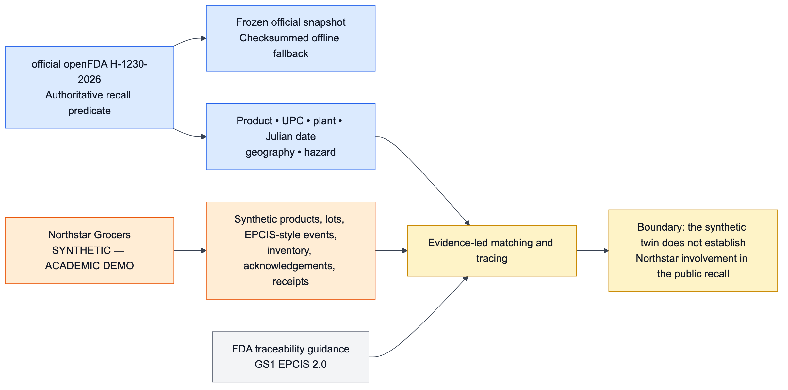

# Data Sources, Provenance, and Retrieval Corpus

Read the [business-domain guide](BUSINESS_DOMAIN.md), [business recall lifecycle](images/08_business_recall_lifecycle.png), and [domain evidence model](images/09_domain_evidence_model.png) first. The central rule is simple: official evidence defines public recall scope; synthetic evidence demonstrates how a fictional retailer could investigate that scope. Neither source is allowed to impersonate the other.

## Source register

| Source | Stored/use form | Audience label | Critical-path role |
|---|---|---|---|
| [openFDA Food Enforcement API](https://open.fda.gov/apis/food/enforcement/) | Hard-coded `api.fda.gov` endpoint for optional live recall lookup | `OFFICIAL — openFDA` | Optional; bounded timeout and labelled snapshot fallback |
| `data/public/H-1230-2026.json` | Frozen response with five enforcement records | `OFFICIAL — openFDA snapshot` | Default reproducible notice evidence |
| [FDA recall definitions](https://www.fda.gov/safety/industry-guidance-recalls/recalls-background-and-definitions) | Paraphrased policy record | `OFFICIAL — FDA reference (paraphrased)` | Classification context |
| [FDA recall guidance](https://www.fda.gov/media/136987/download) | Two paraphrased policy records | `OFFICIAL — FDA reference (paraphrased)` | Initiation, communication, effectiveness, termination context |
| [FDA Food Traceability Rule](https://www.fda.gov/food/food-safety-modernization-act-fsma/fsma-final-rule-requirements-additional-traceability-records-certain-foods) | Paraphrased policy record | `OFFICIAL — FDA reference (paraphrased)` | CTE/KDE/traceability-lot context; no applicability claim |
| [GS1 EPCIS 2.0.1](https://ref.gs1.org/standards/epcis/2.0.1/) | Paraphrased policy record | `OFFICIAL — GS1 reference (paraphrased)` | Event-semantics reference; no conformance claim |
| `data/synthetic/northstar_demo/dataset.json` | Seeded fictional operational twin | `SYNTHETIC — ACADEMIC DEMO` | Product, lot, trace, inventory, shipment, and acknowledgement evidence |
| USDA/FSIS or broader sources | Not called | excluded/future | Not a flagship dependency |

RecallOps has no You.com integration and performs no general web search. Retrieval is over committed, checksummed artifacts. The sole optional live data call is the allowlisted openFDA host `api.fda.gov`; no arbitrary URL supplied by a user or retrieved document is fetched.

## Frozen official snapshot

The frozen openFDA response contains five records: the flagship `H-1230-2026` egg recall plus four neighboring food-enforcement records that provide negative retrieval controls. Its capture endpoint was `https://api.fda.gov/food/enforcement.json?limit=5&sort=report_date%3Adesc`; this is a rolling, mutable endpoint, so the URL documents the historical capture method and is not expected to reproduce the same rows later. The frozen artifact is a field-for-field snapshot of the observed response, not a claim that an unrelated exact-query response supplied all five rows and not a claim of HTTP-byte identity.

On 2026-09-07, a separate live verification used `https://api.fda.gov/food/enforcement.json?search=recall_number.exact%3A%22H-1230-2026%22&limit=5`. It returned one result, and that JSON record matched frozen `results[0]` field-for-field. The metadata records both URLs and methods separately, preserves the original `retrieved_at`, and binds the canonical flagship record digest `16a50f3966d11ee80519c4935890db9a250b36ffccf081f812b8f6d4f5d384de`.

| Artifact | SHA-256 |
|---|---|
| `data/public/H-1230-2026.json` | `086c80b789959dc0612f4d94ca4f199da621158416784a3e1ed0eeeecc260aa9` |
| `data/public/H-1230-2026.metadata.json` | `77b3d1ed5beddd20dcafeecdf2872b4be095c2f64f12582ef285f75e4c9aa3a7` |

The frozen capture is reproducible evidence, not proof of current recall status. Production decisions would need current FDA/firm communications and accountable food-safety/legal review.

## Synthetic Northstar digital twin

The generator uses seed `20260830`, schema `recallops.synthetic-retailer-digital-twin` version `1.1.0`, and a fixed timestamp. The dataset and adjacent manifest are byte-deterministic.

| Collection | Count | Role |
|---|---:|---|
| Products | 48 | Product/UPC exact, near, and background controls |
| Lots | 144 | Exact, probable, ambiguous, rejected, balanced, and gapped cases |
| Facilities | 18 | Two distribution centers and sixteen stores |
| EPCIS-like events | 577 | Receipt, shipment/transfer, sale, return, quarantine, and disposal lineage |
| Inventory positions | 216 | Lot/facility stock and reconciliation evidence |
| Supplier shipments | 144 | One inbound source record per lot |
| Facility acknowledgement seeds | 18 | Acknowledgement/follow-up fixtures |
| Initial cases/tasks/receipts | 0 / 0 / 0 | Runtime operations start empty |

The synthetic dataset SHA-256 is `6f60ce4a3119aae2d68b3ea3c5105d79cc0df9fd335c2c2132218a886f5c61d9`; its manifest SHA-256 is `2356b37e583031e22512ec54472bb2336c0ae8c003addc7a6e0f8f78d85690ea`.

Six anchor lots keep the large corpus hand-auditable. `LOT-EXACT-170` is an exact match with 1,200 received and 50 unaccounted units. `LOT-PROBABLE-160` is a probable match with 900 received and zero unaccounted units. `LOT-AMBIG-175` preserves a questionable plant code. `LOT-REJECT-190`, `LOT-CONTROL-170`, and `LOT-NEAR-150` are rejection controls. The other 138 lots add realistic retrieval and table volume without changing the anchor facts.

## Validation and trust anchors

Loaders do not trust a self-updated manifest alone. Code pins independent SHA-256 values for the public snapshot, metadata, policy corpus, synthetic dataset, and synthetic manifest, then validates:

- schema/version/seed/source label and exact collection counts;
- duplicate IDs, foreign keys, origins, and timezone-aware timestamps;
- shipment/receipt chronology, event-parent lineage, cycles, and facility continuity;
- positive movement quantities and lot-level aggregate reconciliation;
- acknowledgement coverage and immutable anchor lots.

Changing data and merely recomputing an adjacent manifest fails the independent digest check.

## Knowledge corpus

Corpus generation converts each source record into an independently citable document with source class, origin, audience label, record type/ID, source URL, retrieval time, content hash, and structured metadata.

| Corpus slice | Documents |
|---|---:|
| Frozen openFDA records | 5 |
| Paraphrased FDA/GS1 policy records | 5 |
| Synthetic operational records | 1,165 |
| **Total** | **1,175** |

Record-type counts are 577 events, 216 inventory positions, 144 lots, 144 shipments, 48 products, 18 facilities, 18 acknowledgement seeds, five openFDA records, and five policies. Corpus SHA-256 is `939063e983471743d60d6c644ba7b8435d10834aca18f811b95053ce7071a7ef`.

The in-memory hybrid index has 5,930 TF-IDF features and 64 LSA dimensions. BM25 and LSA rank independently; reciprocal-rank fusion and deterministic reranking preserve both component scores/ranks and return content-hash citations.

## Live/cached behavior

`RECALLOPS_SOURCE_MODE=snapshot` is the default. The durable LangGraph runtime explicitly uses the snapshot so replay/evaluation cannot drift. With `RECALLOPS_SOURCE_MODE=live`, the registry/UI notice opener requests an exact recall-number search from the Food Enforcement endpoint with a two-second default timeout and academic user agent. An HTTP error, malformed response, missing result, or mismatched recall number returns the frozen record with `cached=True` and the cached-fallback source label. This runtime request is independent of both frozen-capture provenance and the 2026-09-07 verification receipt.

## Privacy and interpretation limits

The twin contains no real customer PII; customer-like display fields are masked before traces/UI. The project has no real ERP/WMS/POS/supplier access and does not determine whether the Food Traceability Rule applies to a food or firm. This repository is an academic engineering demonstration, not legal or food-safety advice.
