# Data Sources and Provenance

## Source register

| Source | Role | Provenance label | Critical-path status |
|---|---|---|---|
| openFDA Food Enforcement API | Recall notice lookup | `OFFICIAL — openFDA` | Live lookup plus frozen fallback |
| Frozen `H-1230-2026` snapshot | Reproducible flagship case | `OFFICIAL — openFDA snapshot` | Required offline fallback |
| FDA traceability guidance | Policy context | `OFFICIAL — FDA guidance` | Reference resource |
| GS1 EPCIS 2.0 | Event semantics | `OFFICIAL — GS1 reference` | Reference resource |
| USDA FoodData Central | Optional product enrichment | `OFFICIAL — USDA` | Optional only |
| Northstar Grocers data | Product, lot, event, inventory, task, receipt fixtures | `SYNTHETIC_RETAILER_DIGITAL_TWIN`; UI: `SYNTHETIC — ACADEMIC DEMO` | Required demo data |
| USDA FSIS recall API | Possible future adapter | `FUTURE — excluded from flagship` | Not a dependency |

## Public/synthetic separation

`H-1230-2026` is an official public recall used to extract a product/UPC/plant/Julian-date/geography/hazard predicate. Northstar Grocers is fictional. The synthetic data may show exact, probable, ambiguous, and rejected matches, but it does not establish any connection between Northstar and the real recall. This distinction follows each record into citations, tool responses, UI badges, and audit traces.

## Reproducibility

The frozen notice and synthetic dataset are intended to be checksummed. The generator is seeded and idempotent, with referential-integrity validation before use. The final integrated verification should record the snapshot checksum, generator seed, generated-manifest checksum, and command output; no value is asserted here before that run exists.

## Data minimization

The academic twin excludes real customer PII. Customer-like fields are masked before model context and traces. Real ERP, WMS, POS, supplier, or store systems are not accessed.
