# Five-Minute Demo Walkthrough



This is an **approved contract pending Task 11 runtime integration**. [`demo_contract.json`](demo_contract.json) is the single source for its command, fields, controls, status labels, inputs, and timestamps. **Final integration confirmation is required** before recording.

## Preflight

Copy/paste after final integration confirmation:

```bash
uv run recallops data-validate
uv run recallops demo --recall-number H-1230-2026
```

Expected audience-facing source boundary: **official openFDA H-1230-2026** is the authoritative public notice; all Northstar operational records are **SYNTHETIC — ACADEMIC DEMO**. Say this before showing any matches.

## Narration and inputs

| Time | Narration | Contracted screen/action |
|---|---|---|
| 00:00 | “I am opening official openFDA recall H-1230-2026. Northstar Grocers is fictional training data, not a party to this public recall.” | In **Command Center**, enter **Recall number** `H-1230-2026` and select **Open case**. |
| 00:35 | “The graph plans bounded work for intake, matching, traceability, containment, and independent verification. There is no A2A and agents do not directly write records.” | In **Investigation**, select **Run investigation** and show evidence/tool trace. |
| 01:20 | “The quantity equation makes every unit visible. Any unaccounted unit remains a closure blocker.” | In **Reconciliation**, show explicit gaps. |
| 02:00 | “This ambiguous lot pauses at a durable interrupt. The Food-safety manager can approve, edit, reject, or escalate.” | In **Human Review**, show status **Review required**. The contract controls are **Approve**, **Edit**, **Reject**, and **Escalate**. Enter **Decision** `approve`, **Actor** `Food-safety manager`, and **Justification** `Authorize simulated containment for confirmed scope; retain ambiguous lot for review.` |
| 03:10 | “Approval is scoped to the action and case version. Only the approved graph node makes a simulated write.” | Select **Approve**, then **Simulate approved actions**; show status **Simulated action recorded** and the receipt. |
| 04:20 | “Monitoring still protects closure: a missing acknowledgement, ambiguity, or reconciliation gap keeps the case open.” | In **Audit & Evaluation**, select **Request closure** and show **Open — closure blocked**. For the safe alternate decision, enter `escalate` with `Do not close while acknowledgement, ambiguity, or reconciliation gaps remain.` |

The agreed sequence ends with the closure-blocked demonstration. Runtime UI strings and outcome values must be checked against `demo_contract.json` by Task 11 integration tests.

## Evaluator questions

| Question | Answer |
|---|---|
| Is Northstar tied to the real recall? | No. It is a `SYNTHETIC — ACADEMIC DEMO` digital twin. |
| Can an agent make an inventory hold? | No. It can draft; only an approved graph node calls the simulated operations MCP tool. |
| Why not use A2A? | The requirement is explicit stateful orchestration; LangGraph is sufficient and more inspectable here. |
| What happens if openFDA is unavailable? | The app uses a labelled frozen snapshot for the demo. |
| Can the case close with a discrepancy? | No; reconciliation and acknowledgement gates block closure. |
