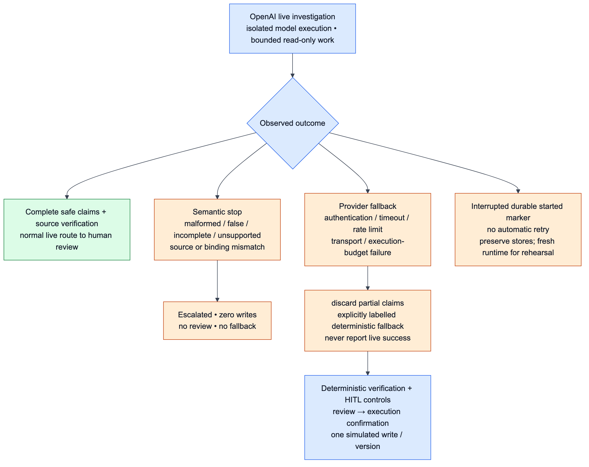

# RecallOps 4:55 Demo Walkthrough


This script is derived from [`demo_contract.json`](demo_contract.json) and the implemented durable runtime/five-view UI. The [five-minute story](images/recallops-five-minute-demo.png) is the presentation overview; the [system architecture](images/recallops-system-architecture.png), reproducible [demo-story diagram](images/07_demo_story.png), and [evaluation architecture](images/10_evaluation_architecture.png) provide progressively deeper proof. The timed table below is a 4:55 presentation sequence after rehearsal. Live latency is variable: pause the presentation clock while **running**, or pre-run the investigation in the same durable case and disclose that the recorded trace is a replay. Never promise completion within a fixed provider latency. Use the [business-domain guide](BUSINESS_DOMAIN.md), [business recall lifecycle](images/08_business_recall_lifecycle.png), and [domain evidence model](images/09_domain_evidence_model.png) for a one-slide orientation before the timed product walkthrough.

## Preflight

Prerequisites: Python 3.12, `uv`, Node 24.15.0, npm 11.12.1, and an OpenAI account/model with tool-calling access. Live calls incur provider usage. Work in the repository root; keep credentials out of recordings.

If `.env` does not exist, copy `.env.example` to `.env` using your editor. If it exists, edit only the following fields in place. Supply your real key privately and the exact model identifier available to your account; the angle-bracket values below are placeholders, not runnable credentials.

```dotenv
RECALLOPS_MODEL_MODE=openai
OPENAI_API_KEY=<enter-your-key-privately>
OPENAI_MODEL=<your-tool-calling-model-id>
OPENAI_REASONING_EFFORT=medium
OPENAI_TIMEOUT_SECONDS=120
OPENAI_MAX_RETRIES=0
RECALLOPS_SOURCE_MODE=snapshot
RECALLOPS_UI_MODE=durable
LIVE_MODEL_ADAPTER=
```

`.env` is Git-ignored. Never paste its contents into a report, screenshot or terminal recording. Process environment values take precedence, so clear any stale overrides before launch. `OPENAI_EMBEDDING_MODEL` is not needed for the local LSA retrieval lane.

The default request timeout is 120 seconds with no automatic retries. `OPENAI_TIMEOUT_SECONDS` accepts a positive decimal up to 600; `OPENAI_MAX_RETRIES` accepts 0–3. `OPENAI_REASONING_EFFORT` accepts `none`, `low`, `medium`, `high`, or `xhigh`, and defaults to `medium`. This is the application's allowlist, not a promise every configured model supports every value; use a compatible model/effort pair. Readiness validates configuration, not provider compatibility. These are per-request controls; the live service also limits model and read calls. A timed-out request can still incur provider usage. Preserve a cancelled run and use a fresh runtime for an explicitly authorized attempt.

Run:

```bash
uv sync --locked --all-groups
uv run recallops data-validate
uv run recallops demo --recall-number H-1230-2026
uv run recallops eval-scorecard --scorecard data/evals/scorecard.json
make ui-openai
```

For the recorded run, launch Streamlit against a fresh explicit runtime directory so an earlier rehearsal cannot supply stale case state:

```bash
RECALLOPS_DEMO_DIR="$(mktemp -d /tmp/recallops-demo.XXXXXX)"
make ui-openai RUNTIME_DIR="$RECALLOPS_DEMO_DIR"
```

For the MCP protocol version of the UI, replace the last command with:

```bash
RECALLOPS_MCP_TRANSPORT=stdio make ui-openai
```

Use durable mode, not the UI fixture mode. Confirm the browser opens on **Command Center** with no existing case. Keep the terminal available for the short CLI proof, but record the UI as the primary walkthrough.

Before opening the case, confirm **Reasoning mode: OpenAI · <model>** and status **ready**. Readiness proves configuration only; it does not prove a provider request succeeded. After investigation, require **completed**, all four specialists and accepted verification before describing a successful live run. **running**, **failed**, and explicit deterministic fallback are different outcomes.


## Model proof checklist

Before running, show **Investigation lot scope** in **Investigation**. Its searchable multiselect exposes all 144 synthetic lots. Keep the official four-lot smoke default: `LOT-EXACT-170`, `LOT-PROBABLE-160`, `LOT-AMBIG-175`, `LOT-REJECT-190`. The UI and smoke share one canonical scope constant. You may select 1–64 unique known lots before the first run; empty, unknown, duplicate or oversized scope is rejected before provider invocation. The selection locks after start/checkpoint. The full dataset remains 144 lots, while this active investigation is bounded to four. A new case restores the default; the separate fixture mode keeps a fixed read-only four-lot walkthrough.

1. Run `H-1230-2026` and show **Agentic RAG retrieval trace**: official/synthetic citation origins, sparse+dense fusion, rerank, bounded policy critique/rewrite, and the stop reason. The retrieval critic is policy-based, not an LLM.
2. Show **Reasoning run → Live plan**. It is the safe role projection of the observed LLM `write_todos` call, not stored plan prose or hidden reasoning.
3. On a successful run, show four sequential LLM roles: `recall-intelligence` → `product-lot-matching` → `traceability-reconciliation` → `containment-communications`. A child must complete required scoped evidence reads and its strict typed response before the next role. One fixed, application-owned completion correction is allowed; repeated invalid completion stops. Source/binding/unauthorized-tool/provider failures do not get this correction retry. The next role receives case/scope/RAG context and validated prerequisite claims only after that completion gate. Containment has no MCP read tools; it consumes those claims. Exact compiled hook identities protect the gate; this is control infrastructure, not a deterministic reasoning substitute.
4. Show **Live model and tool-call trail**: read-only MCP calls such as `get_recall`, `match_lots`, `trace_forward` and `reconcile_units`; there is no Operations tool. The sanitized summary and token usage appear only when returned by the provider. Unavailable usage is not zero.
5. Explain safe typed claims: exact source identifiers/quantities, bounded digests, read receipts and no-execution declarations. The independent source verifier re-reads source records and compares complete evidence before the durable case can gain actionable scope. Display wording/action IDs are application-owned. Private raw prompts, raw model messages and chain-of-thought are never persisted or shown.
6. Only accepted verification reaches **Human Review**. Then demonstrate both HITL gates, simulated receipts and blocked closure below.

Live metrics remain unavailable for a successfully completed four-specialist investigation and durable HITL E2E. The latest authorized September 12, 2026 attempt, after matching prompt hardening and privacy fixes, used real OpenAI `gpt-5-mini` / `medium` and the exact four-lot scope: **371.975 seconds**, **7 completed model calls + 1 failed event**, **82,420 tokens** (63,115 input / 19,305 output). The exact four-role plan was observed and recall intelligence completed. Three read events were observed: recall-intelligence: `get_recall`; matching: `find_candidate_products` + `match_lots`. Matching's sole correction model call then timed out at **120.006 seconds**. The live result was `execution_failure` / `timeout`; explicit `deterministic_fallback` reached `review_required` / `action_review`. Any independent verification shown in that runtime belongs to the fallback, **not live proof**. The harness rejected the result and did not approve or confirm. Operations cases, write receipts, inventory holds and execution grants were all zero; one workflow identity ownership row is expected. Cost is unavailable. This is failure/resilience evidence, not successful live performance.

The earlier semantic-failure attempt took 195.583 seconds, eight completed model calls and 83,995 tokens: matching failed after one bounded correction, with no released claims/read receipts or HITL/writes. Earlier historical attempts timed out or stopped before reads; a pre-completion-gate attempt took 314.421 seconds, nine model calls and 140,356 tokens, also failing at matching. These are separate attempts, not combined totals. Offline compiled-graph tests inspect the real outgoing schemas and exact middleware executables; passing those tests does not establish live E2E success.

**Choose the truthful presenter branch.** If a newly authorized live run fails, stop the live story at its sanitized failure and show only actual roles/reads. A semantic failure stops before review; a provider timeout may reach review through explicitly labelled deterministic fallback. Do not call that fallback's verification or review successful live proof. The latest harness did not approve or confirm it. For the demonstrated dual-consent sequence below, open a separate fresh runtime with `RECALLOPS_MODEL_MODE=deterministic make ui` and announce **deterministic control demonstration**. Never mix its receipts with live evidence. Only a future successful four-role/source-verified live case may continue directly into those human gates; that expected route is not currently demonstrated.

## Failure-recovery rehearsal

Rehearse this once in a separate fresh deterministic runtime; do not arm it during the live take. Open the case, run the investigation, approve the `create_case` packet, and stop before execution. In **Audit & Evaluation**, choose **lost write response → same-key replay** under **Failure scenario** and click **Run failure fixture**. Return to **Human Review** and click **Simulate approved actions**. The durable graph should pause at outcome recovery; click **Recover recorded outcome (same key)**. Show that the retry returns one logical receipt and one version increment rather than a duplicate write. Then close that rehearsal process and use a newly created runtime directory for the timed script.

## Copy/paste card

| Field | Exact value |
|---|---|
| **Recall number** | `H-1230-2026` |
| **Investigation lot scope** | `LOT-EXACT-170`, `LOT-PROBABLE-160`, `LOT-AMBIG-175`, `LOT-REJECT-190` |
| **Decision** | `approve` |
| **Actor** | `Food-safety manager` |
| **Justification** | `Authorize simulated containment for confirmed scope; retain ambiguous lot for review.` |
| Escalation alternative | `Do not close while acknowledgement, ambiguity, or reconciliation gaps remain.` |

The decision vocabulary is exactly `approve`, `edit`, `reject`, and `escalate`; the visible controls are **Approve**, **Edit**, **Reject**, and **Escalate**.

## Timed script

The evaluation quotation is the pinned historical offline report narration from `demo_contract.json`; “credentials were missing” describes that committed report only. It says nothing about the current live UI run. Introduce it as the offline baseline and show the additional live lane separately below.

The table is an **expected verified-live route**, not a claim that the latest live attempt reached it. For today's evidence-backed take, show the failed live trace during Investigation, say “matching's sole correction timed out; fallback reached review, but its verification is not live proof and the harness did not approve or confirm,” then pause the clock and visibly switch to the separately labelled deterministic case before Reconciliation. The consent/receipt/closure segment demonstrates deterministic controls. Provider latency and any mode switch are outside the 4:55 narrated sequence; disclose all prerecorded traces.

| Time | Click/show | Say |
|---|---|---|
| 00:00 | Confirm **Reasoning mode** is OpenAI and **ready**. In **Command Center**, keep `H-1230-2026` in **Recall number** and click **Open case**. Point to the official and synthetic badges. | “This is a real openFDA enforcement record and a separate fictional Northstar digital twin. The public notice does not prove retailer involvement. There is no You.com or general web search; the default path is frozen and checksummed.” |
| 00:35 | Open **Investigation**, show **Investigation lot scope** with four selected / 144 available, then **Run investigation**. Show the retrieval trace, observed **Live plan**, actual completed roles and **Live model and tool-call trail**. Proceed in live mode only if all four roles and the independent verifier succeed; otherwise follow the failed-run branch above. | “OpenAI plans and delegates to four bounded LLM specialists. Matching's sole correction timed out. Explicit deterministic fallback reached review; its verification is not live proof. The harness rejected it without approval or confirmation. The separate deterministic case now demonstrates human controls—not live success.” |
| 01:20 | Open **Reconciliation**. Point to the exact equation, `LOT-EXACT-170` gap, ambiguous lot, and evidence links. | “The model cannot explain away a missing unit. Structured trace and reconciliation stay authoritative: received equals on-hand, quarantined, sold, returned, disposed, plus unaccounted. Fifty exact-lot units and ambiguity remain visible closure blockers.” |
| 02:00 | Open **Human Review**. Show **Review required**, action `create_case`, case version 0, digest, sources, gaps, and remaining actions. Confirm **Decision**, **Actor**, and **Justification** have the copy/paste values. | “The first interrupt is one exact proposal at one exact version. Approval is not execution. Edit returns through verification; Reject writes nothing; Escalate stops safely.” |
| 02:35 | Click **Approve**. Explicitly show that no receipt appeared and that a separate execution confirmation is pending. Then click **Simulate approved actions** and show **Simulated action recorded**, action `create_case`, and the v0→v1 receipt. | “Approve recorded zero writes. This second confirmation lets only the approved graph node call Operations MCP once. The receipt binds actor, justification, action digest, idempotency key, and version.” |
| 03:05 | Stay in **Human Review** and show the next **Review required** packet: `apply_inventory_hold`, version 1, confirmed lot targets, and a new digest/key. | “The first approval expired when the case version changed. The graph replans, so the hold needs a fresh review. The ambiguous lot is retained for review and cannot be smuggled into confirmed scope.” |
| 03:40 | Click **Approve**, show the second execution confirmation, click **Simulate approved actions**, and show the `apply_inventory_hold` v1→v2 receipt plus **Simulated action recorded**. | “This is one write per version, not a batch convenience call. Both records are simulated; no real inventory system was touched.” |
| 04:00 | Open **Audit & Evaluation**. Show the verified scorecard, then reveal **Safety**, **Retrieval quality**, and **Orchestration quality** in that order. Point to 21/21; the six configuration rows; `+0.00568`, `+0.00527`, and `0/0/8`; the two profile rows and zero quality/tool-call deltas; and `not_run_missing_credentials`. Mention the separately rehearsed exact-key recovery. If the scorecard cannot load, show the preflight `eval-scorecard` summary and committed reports instead—never substitute a fixture. | “Safety proves no approval bypass or false close: 21 of 21 scenarios pass. Retrieval evals compare six ablations—BM25, local LSA, naive hybrid, RRF, reranking, and agentic RAG—on the same 96 labelled questions. Fusion Recall-at-five delta is plus 0.00568; rerank nDCG-at-five delta is plus 0.00527; eight rewrites are unchanged, so no uplift is assumed. The 24-case orchestration benchmark compares a bounded single agent with four specialists. Evidence coverage, task success, duplicate work, tool-call deltas, and latency are measured, not assumed; quality and tool-call deltas are zero. Optional Deep Agents was not run because credentials were missing and is excluded from offline gates.” |
| 04:45 | Click **Request closure** and point to **Open — closure blocked** and its returned blockers; finish by 04:55. | “Closure is a separate decision, not a side effect of containment. Ambiguity and reconciliation evidence keep this synthetic retailer case open; FDA termination remains separate.” |

## What the audience should have seen

Items 2–5 and 8 describe the verified route/control demonstration. If the live attempt failed, identify the deterministic case supplying those later results; do not attribute them to OpenAI.

1. Official and **SYNTHETIC — ACADEMIC DEMO** evidence never merge into a claim of retailer involvement.
2. Agentic RAG, consumed task order, sequential specialist execution, independent verification, and MCP calls are visible, bounded, and cited.
3. **Approve** and **Simulate approved actions** are two different human decisions.
4. `create_case` v0→v1 and `apply_inventory_hold` v1→v2 each produce one durable receipt.
5. Audit/recovery evidence makes retries and stale/concurrent requests inspectable.
6. Three digest-verified evaluation sections report measured offline evidence: 21 safety cases, 96 retrieval cases across six configurations, and 24 orchestration cases across two profiles.
7. The observed retrieval deltas are modest, the deterministic orchestration quality/tool-call deltas are zero, and the optional live Deep Agents run is visibly excluded—not narrated as uplift.
8. **Request closure** ends **Open — closure blocked**, which is the intended flagship safety outcome.

## Optional positive-close proof (outside the timed flagship)

Do not replace the blocked flagship with a happy path. If a reviewer asks whether closure can ever succeed, open `data/evals/report.json` at R17 or run the evaluator and explain: the isolated `LOT-PROBABLE-160` scope has zero unaccounted units; the runtime performs reviewed disposition if needed, facility tasks, one acknowledgement per required facility, a separate closure review and execution confirmation, then one `close_case` receipt. Operations revalidates all gates transactionally.

## Presenter Q&A

| Question | Answer |
|---|---|
| Why not use You.com/web search? | General search adds nondeterministic/untrusted critical-path data. RecallOps uses an allowlisted openFDA lookup plus a frozen snapshot and committed FDA/GS1 references. |
| Is LSA really dense retrieval? | Yes: TF-IDF vectors are projected into a local 64-dimensional latent semantic space. It is deliberately called local LSA, not neural embeddings. |
| Is Deep Agents actually present? | Yes: OpenAI mode invokes the real `write_todos` supervisor and configures four sequential LLM specialists. The latest provider attempt observed the plan, completed recall intelligence and timed out during matching's sole correction; not all four completed. Fallback review is not live proof. The committed comparative evaluation is separately `not_run_missing_credentials`; agents never receive Operations tools. |
| Did multi-agent orchestration outperform the baseline? | Not in this deterministic 24-case corpus: evidence coverage, task success, duplicate work, and total tool-call deltas are zero. The profiles make delegation observable; the report does not claim unsupported uplift. |
| Why two approvals? | The first approves the evidence-bound action. The second confirms execution with the persisted execution ID/key. This prevents “approve” from silently becoming a write. |
| What if the process restarts? | Reopen the same checkpoint and Operations database paths. The same thread/checkpoint/interrupt resumes; completed reasoning is not rerun. |
| Are Northstar holds real? | No. Every operational record/receipt is **SYNTHETIC — ACADEMIC DEMO** and status `simulated`. |
| Is internal close FDA termination? | No. FDA termination is an external regulatory decision; RecallOps only simulates closing a fictional retailer case. |

## Two evaluation lanes

Run the reproducible lane before recording:

```bash
make eval
make eval-summary
```

Run the additional measured live lane separately, with the same local OpenAI setup:

```bash
make eval-model LIVE_SMOKE=1 LIVE_SMOKE_REPORT=/tmp/recallops-live-smoke-new.json
```

This executes exactly one four-lot `H-1230-2026` smoke investigation through the shared provider and source verifier. It writes only sanitized measured status, plan/order checks, call counts, digests, duration and available tokens to a new separate report. Existing output files are refused before provider use; choose a new path for each authorized run. It returns nonzero on provider or verification failure. Cost is unavailable. This smoke is not the 24-case comparative benchmark and supplies no benchmark uplift claims; it does not change the deterministic corpus, reports or scorecard. No custom adapter is required.

The one-case smoke command calls retrieval → live service → independent source verifier directly: **it does not execute HITL or Operations**. The newer terminal runtime harness is separate: it observed timeout and fallback action review, rejected fallback as live proof, and did not approve or confirm. Whole-agent live E2E additionally requires the same successful live claims to enter a durable case, both human gates, version-bound simulated receipts and the closure block. Neither failed attempt proves successful live investigation or the full human lifecycle.

Only when the full 24-case provider spend is explicitly intended, run `make eval-model` without `LIVE_SMOKE=1`. That command regenerates the orchestration report and combined scorecard; retain their resulting digests. Both live lanes are excluded from deterministic pass/fail gates. Inspect live status even if the offline gate passes, and never narrate fixture results as model success or invent unavailable metrics.

## Semantic stop and Provider fallback



**Semantic stop:** a child with an incomplete typed completion or missing required reads receives at most one fixed correction. A repeated invalid completion, or malformed/false/incomplete/contradictory/unsupported final claims, stops before review. Source/binding/unauthorized-tool failures stop without that correction. No semantic fallback and zero writes. Show sanitized violation codes and source evidence; do not bypass the verifier for a presentation. Provider failures follow the separately labelled resilience policy, not the child correction loop.

**Provider fallback:** an authentication, timeout, rate-limit, transport or execution-budget failure may discard partial claims and enter explicitly labelled deterministic fallback. Show the failure category and fallback label; never say the LLM completed. Both HITL gates remain required. Rehearse failure fixtures separately; they demonstrate controls, not a real provider outage.

## Reset

Stop Streamlit. Preserve the prior runtime directory with its paired checkpoint/Operations databases for audit. Create a fresh directory using the preflight `mktemp` command and relaunch `make ui-openai RUNTIME_DIR="$RECALLOPS_DEMO_DIR"`. This resets the rehearsal without deleting data. To resume a pending human review, reopen the original directory instead. A cancelled live run left at its durable started marker is not automatically retried; use a fresh runtime for a fresh investigation.

## Troubleshooting

| Observation | Next step |
|---|---|
| Startup rejects key/model/mode | Privately correct the ignored `.env`; check stale process overrides; never print secrets |
| Ready, then authentication/rate-limit/timeout failure | Ready is configuration-only; inspect the sanitized category, fix provider access, then rehearse in a fresh runtime |
| Semantic verification failure | Preserve evidence and violation codes; do not request an approval or silently take fallback |
| No live plan/tool trail | Check OpenAI mode and actual completed status; a deterministic fixture or fallback is not live proof |
| Missing tokens or live benchmark metrics | State unavailable; run `make eval-model` separately when authorized and inspect its own status |
| Review is stale / wrong version | Reload the current packet and give fresh review; do not reuse an old digest or key |
| Lost write response | Use **Recover recorded outcome (same key)**; show the single logical receipt |
| Port already in use | Launch with `make ui-openai PORT=8765` |
| Closure remains blocked | Expected for flagship ambiguity and the quantity gap; show blockers and keep open |
