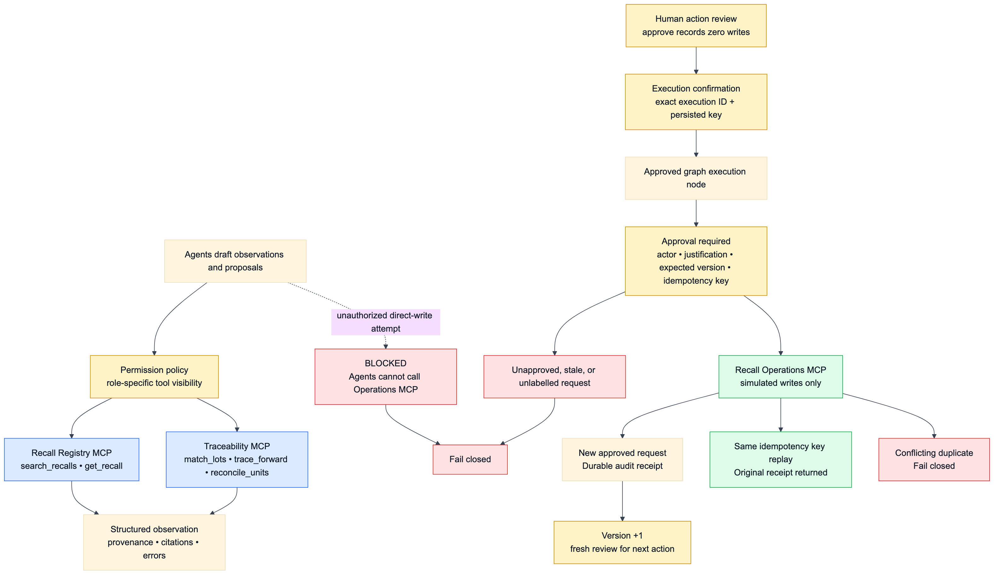

# MCP Servers and Tool Safety



MCP is RecallOps’ vertical integration boundary; it is not agent-to-agent communication. LangGraph owns coordination and state. The same typed gateway contract supports direct in-process calls for fast deterministic runs and actual stdio FastMCP subprocesses through `MultiServerMCPClient`.

## Server inventory

### Recall Registry MCP — read-only

| Tool/resource | Purpose |
|---|---|
| `search_recalls(query)` | Search the configured recall source |
| `get_recall(recall_number)` | Return one typed recall record or `None` |
| `get_product_metadata(upc)` | Extract UPC metadata from the configured recall evidence |
| `search_regulatory_evidence(query, top_k, record_types)` | Hybrid-search only official recall/policy documents |
| `recallops://policy/provenance` | State the frozen-source/checksum rule |

### Traceability MCP — read-only

| Tool/resource | Purpose |
|---|---|
| `find_candidate_products(predicate)` | Score synthetic product candidates |
| `match_lots(predicate)` | Classify exact/probable/ambiguous/rejected lots |
| `trace_forward(lot_id)` / `trace_backward(lot_id)` | Follow causal EPCIS-like lineage |
| `get_inventory(lot_id)` / `get_sales(lot_id)` | Return synthetic inventory/sale evidence |
| `reconcile_units(lot_id)` | Return all seven quantity components and evidence IDs |
| `search_operational_evidence(query, top_k, record_types)` | Hybrid-search only synthetic documents |
| `recallops://policy/synthetic-boundary` | State the fictional-data boundary |

### Recall Operations MCP — simulated write-sensitive

| Tool | State transition |
|---|---|
| `create_case` | Persist the first simulated case and authoritative evidence; v0→v1 |
| `apply_inventory_hold` | Record a reviewed simulated hold for confirmed lots |
| `record_disposition` | Append a provenance-labelled disposition event for a specifically evidenced lot-level quantity gap |
| `create_facility_tasks` | Create tasks for every authoritatively required facility |
| `record_acknowledgment` | Record one facility acknowledgement |
| `close_case` | Revalidate every closure predicate and record simulated internal closure |

All tools return JSON-shaped typed results. Operation tools return an `AuditReceipt` with case/action/version, status `simulated`, actor, justification, idempotency key, timestamp, reviewed action, and action-specific details.

## Transport parity

`DirectGateway` constructs trusted local services. `StdioMCPGateway` launches three Python modules and calls tools by server/name. `ClosedRetrievalGateway` uses two sealed read capabilities—regulatory and operational—over direct or stdio transport. The evaluator exercises direct/stdio tool parity and a complete stdio investigation path.

Generate a safe MCP client configuration with:

```bash
uv run recallops mcp-config
```

Demonstrate the product through real stdio MCP subprocesses with:

```bash
RECALLOPS_MCP_TRANSPORT=stdio uv run recallops demo --recall-number H-1230-2026
```

## Read contract

Read middleware applies a budget, circuit breaker, bounded transient retry, typed validation, provenance checks, masking, and structured telemetry. The graph can use the frozen recall after a simulated registry outage but labels the fallback. Missing or malformed required evidence stops fail-closed before operational writes.

Hybrid search preserves source routing. Registry retrieval accepts only official origins; Traceability retrieval accepts only `SYNTHETIC_RETAILER_DIGITAL_TWIN`. Retrieved citations contain record identity, source URL, content hash, and origin.

The live LLM graph receives sealed, request-scoped read capabilities rather than the unrestricted gateway. Candidate-product and lot results are filtered to the bound investigation scope; trace/inventory/reconciliation reads cannot name an out-of-scope lot. The UI/smoke flagship shares four selected lots while retaining all 144 in the dataset. Role capabilities remain separate: recall intelligence reads Registry, matching reads candidates/lots, traceability reads lineage and quantities, and containment has no MCP tools. Required read names and input digests are checked at child completion, with at most one fixed completion correction. Source/binding/unauthorized-tool/provider failures do not enter that correction loop. The final independent verifier separately re-reads pinned sources and recomputes the receipt contract; tool events alone are not accepted claims or authorization.

## Write contract

Agents cannot see or invoke Operations tools. The trusted graph node may call one Operations tool only after:

1. the pending review exactly matches case/thread/version/action/action digest;
2. a human `approve` decision supplies actor and justification;
3. the graph records zero writes and raises a distinct execution-confirmation interrupt;
4. the user confirms the persisted execution ID and idempotency key;
5. `ApprovalGuard` revalidates the action binding and expected version;
6. the active checkpoint resume persists a one-use execution grant bound to the checkpoint head, workflow/execution requests, case/version, action digest, actor, and operation hash;
7. the Operations transaction atomically consumes that grant and independently reloads the configured recall, recomputes its predicate and lot classification, and revalidates target evidence plus action-specific lifecycle predicates.

The execution-grant issuer is not exposed by `OperationsService`, the direct gateway, or any MCP tool. A runtime-only broker owns a durable random checkpoint-store capability; it authenticates the active head plus the exact confirmed execution ID/request digest before issuance. Supplying a caller-authored approval envelope is therefore insufficient: every write tool also requires the exact unconsumed grant created by the trusted workflow resume, and consumption rechecks the same active-attempt bindings.

There is no automatic write retry. If a response is lost after commit, the graph checkpoints `write_outcome_unknown` and asks a human whether to retry with the exact same persisted key. Exact replay returns the original receipt; a changed request under that key is an idempotency conflict.

## Closure authority

`close_case` never trusts RAG or a model conclusion. In one transaction, Operations checks that the case exists and is open, all case-scope lots have persisted holds, disposition events agree with their append-only ledger, reconciliation recomputed from base inventory plus dispositions is complete, every required task/facility is covered and acknowledged, ambiguity/evidence gaps are resolved, and approval/grant bind the exact close action. Internal Northstar closure remains separate from FDA recall termination.

## Explicit exclusions

There is no A2A, agent-to-database edge, general web-search tool, You.com integration, arbitrary URL fetcher, real notification, or production action connector.
