# MCP and Tool Safety

MCP is the vertical boundary between reasoning and information/actions. LangGraph coordinates agents; MCP does not create agent-to-agent communication, and RecallOps uses no A2A protocol.

| Server | Tools | Access | Guardrail |
|---|---|---|---|
| Recall Registry MCP | `search_recalls`, `get_recall`, `get_product_metadata` | Read-only | Source and snapshot provenance returned with observations |
| Traceability MCP | `find_candidate_products`, `match_lots`, `trace_forward`, `trace_backward`, `get_inventory`, `get_sales`, `reconcile_units` | Read-only | Synthetic provenance, typed schema, bounded searches |
| Recall Operations MCP | `create_case`, `apply_inventory_hold`, `create_facility_tasks`, `record_acknowledgment`, `record_disposition`, `close_case` | Simulated write-sensitive | Approval, actor, justification, expected version, idempotency key, durable receipt |

The application supports a direct gateway for fast deterministic tests and a stdio gateway using `MultiServerMCPClient` for protocol demonstrations. The gateway interface is the same; a different transport cannot weaken authorization.

## Write contract

An operation write is rejected unless it supplies a matching approved decision, actor, justification, expected case version, and idempotency key. Stale versions are rejected. Lost responses are replayed with the same key. Tools return a receipt rather than silently mutating state. Agents may draft actions but cannot invoke writes directly; only an approved graph node uses the operations gateway after resume.

## Tool observation contract

Tool results are structured observations with source identity, provenance, timestamps/receipt where applicable, citations, status, and errors. Schema and provenance middleware reject unlabelled observations. Read permissions prevent specialist roles from seeing write tools.
