# Middleware and Human Review

Middleware is observable behavior at boundaries, not a slide-only feature. It injects case/source context, requires a bounded plan, routes deterministic or live models, validates structured outputs, summarizes large evidence while retaining citations, limits calls, masks customer-like fields, and records node/tool outcomes.

| Boundary | Policy | Safe behavior |
|---|---|---|
| Agent start | Case context + task-plan policy | Carry case ID, role, provenance labels, limits, and completion criteria. |
| Model | Router, retry/fallback, call budget, structured output | Select configured mode; fall back deterministically; reject malformed outputs. |
| Tool | Permission, schema/provenance, retry/circuit breaker, tool budget, masking | Narrow capability, bounded reads, fail-closed writes, clean observations. |
| Graph | Progress watchdog + trace recorder | Escalate repeat signatures and retain route/node/tool/duration/status evidence. |
| Side effect | Approval guard + idempotency/version | Block unauthorized, duplicate, or stale writes. |
| Verification | Reconciliation and contradiction guard | Do not close with gaps, ambiguity, or missing acknowledgement. |

## Human-in-the-loop lifecycle

The graph uses `interrupt()` for ambiguous lot matching, pre-action review, reviewer edits/disputes, and closure review. The flagship path consolidates pre-action review and keeps the final closure gate. A reviewer receives a packet containing scope, match rationale, affected lots/facilities, the quantity equation, gaps, proposed actions, confidence, citations, and tool trace.

Allowed review decisions are `approve`, `edit`, `reject`, and `escalate`. Resume occurs by the same `thread_id` with `Command(resume=...)`. Approval is scoped to the proposed action/version; it is not a blanket permission. An edit returns through verification before any write can occur.

